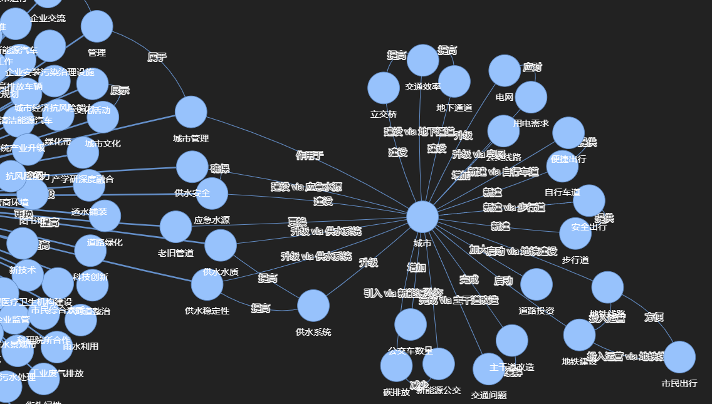
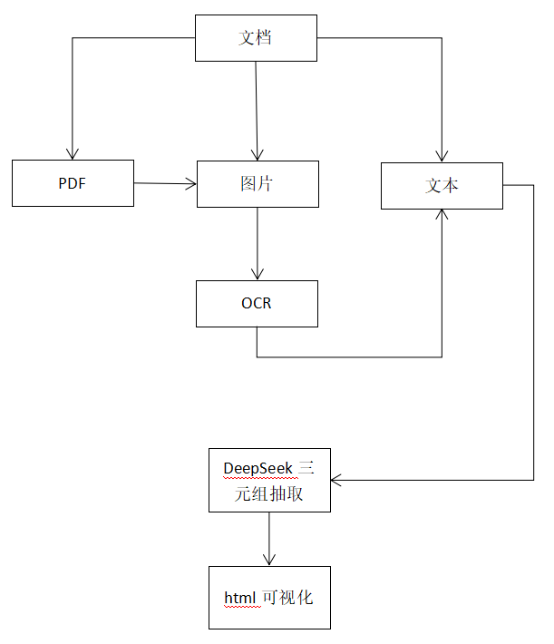

# LLM中文知识图谱生成

本项目利用大模型LLM对中文文本、图片以及pdf中的非结构化文本内容进行分析，并提取主-谓-宾（SPO）三元组的知识形式，以及将这些关系可视化为知识图谱。

## 相关功能
这里利用deepseek进行相关分析
- **OCR**: 对图片和pdf进行OCR识别提取文本
- **分块**: 文本分块
- **知识抽取**: 抽取实体和关系
- **实体标准化**: 确保实体名的一致性
- **关系推理**: 对图谱中未连接的实体进行关系推理
- **可视化**: 图形可视化html

## 开始
1. 配置文件见`config.toml`
2. 运行main.py
3. 文本分析的llm提示语见prompts.py

**控制台输出:**

```markdown
==================================================
1: 三元组抽取
==================================================
Processing text in 8 chunks (size: 500 words, overlap: 100 words)
Processing chunk 1/8 (463 words)
response:<Response [200]>
Processing chunk 2/8 (463 words)
response:<Response [200]>
Processing chunk 3/8 (460 words)
response:<Response [200]>
Processing chunk 4/8 (457 words)
response:<Response [200]>
Processing chunk 5/8 (463 words)
response:<Response [200]>
Processing chunk 6/8 (463 words)
response:<Response [200]>
Processing chunk 7/8 (463 words)
response:<Response [200]>
Processing chunk 8/8 (249 words)
response:<Response [200]>

Extracted a total of 239 triples from all chunks

==================================================
2: 实体标准化
==================================================
Starting with 239 triples and 217 unique entities
Standardizing entity names across all triples...
response:<Response [200]>
Found JSON in code block, extracting content...
Applied LLM-based entity standardization for 15 entity groups
Removed 10 self-referencing triples
Standardized 217 entities into 199 standard forms
After standardization: 229 triples and 138 unique entities

==================================================
3: 关系推理
==================================================
Starting with 229 triples
Top 5 relationship types before inference:
  - 提高: 29 occurrences
  - 加强: 25 occurrences
  - 建设: 18 occurrences
  - 注重: 11 occurrences
  - 提供: 8 occurrences
Inferring additional relationships between entities...
Identified 3 disconnected communities in the graph
response:<Response [200]>
Inferred 3 new relationships between communities
response:<Response [200]>
Inferred 6 new relationships between communities
response:<Response [200]>
Inferred 9 new relationships between communities
response:<Response [200]>
Inferred 7 new relationships within communities
Inferred 142 relationships based on lexical similarity
Added 192 inferred relationships

Top 5 relationship types after inference:
  - is type of: 142 occurrences
  - 提高: 24 occurrences
  - 建设: 17 occurrences
  - 加强: 16 occurrences
  - 注重: 10 occurrences

Added 225 inferred relationships
Final knowledge graph: 421 triples

可视化html保存在以下路径中:
llm-knowledge-graph\data\knowledge_graph.html

```

## 工作流程

1. **分块**: 文档被分割成重叠的块，以适应LLM的上下文窗口
2. **首先 - SPO三元组抽取**: 
   - 每个块由LLM处理，提取主语-谓语-宾语三元组
   - LLM识别实体及其在每个文本段中的关系
   - 收集所有块的结果以形成初始知识图
3. **然后 - 实体标准化**:
   - 通过文本规范化实现基本标准化
   - 可选的llm辅助实体对齐（由`standardization.use_llm_for_entities`配置）
   - 当启用时，LLM检查图中的所有唯一实体，并识别引用相同概念的组
   - 这解决了相同实体在不同块中出现不同的情况（例如，“AI”，“人工智能”，“AI系统”）
   - 标准化有助于创建一个更加连贯和可导航的知识图谱
4. **再次 - 关系推理**:
   - 传递关系的自动推理
   - 可选的llm辅助推理，用于在不相连的图谱组件之间(由`inference.use_llm_for_inference`配置)
   - 启用后，LLM分析来自不相连社区的代表性实体，并推断出合理的关系
   - 通过添加文本中没有明确说明的逻辑连接来减少图谱碎片
   - 基于规则和基于llm的推理方法一起工作，以创建更全面的图谱
   - 【如果关系推理不准，可以在config.toml将其关闭】
   
5. **可视化**: HTML可视化

## 可视化

- 利用networks与pyvis进行三元组可视化

## 程序流程


## reference
- https://github.com/jiangnanboy/text_grapher
- https://github.com/robert-mcdermott/ai-knowledge-graph
- https://github.com/RapidAI/RapidOCR
